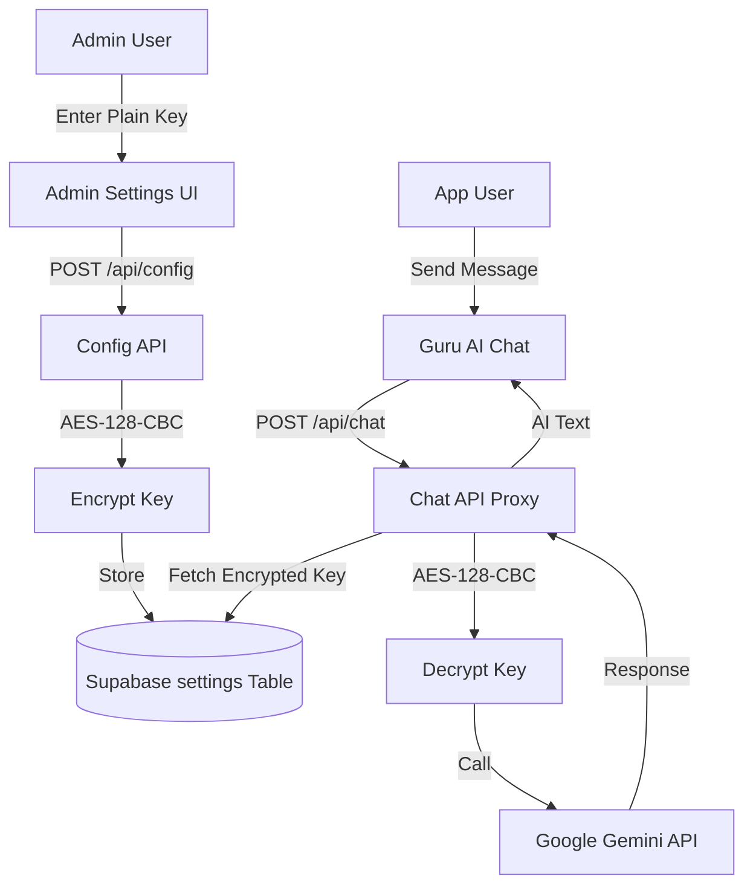

# Gemini AI Chatbot Integration Guide

This document outlines the architecture, data flow, and UI/UX flow for the secure Gemini AI integration within the Mantra Puja Admin Panel and Mobile App.

## 1. System Architecture

The integration uses a **Secure Proxy Pattern**. The mobile app and admin frontend never interact with the Google Gemini API directly. Instead, they go through a server-side route that handles decryption and API communication.

### Data Flow Diagram

## 2. Database Schema

The `settings` table is used for persistent, encrypted storage.

| Column | Type | Description |
| :--- | :--- | :--- |
| `key` | VARCHAR (PK) | Configuration identifier (e.g., `gemini_api_key`) |
| `value` | TEXT | Encrypted payload (format: `iv:encrypted_data`) |
| `updated_at` | TIMESTAMP | Last modification time |

**Migration**: `supabase/migrations/20260306_create_settings.sql`

## 3. Security Implementation

### Encryption Method
- **Algorithm**: `aes-128-cbc`
- **Key Source**: `ENCRYPTION_STRING_KEY` (16-digit string from `.env.local`)
- **IV**: Randomly generated for every encryption and prepended to the stored value.

### Access Control (RLS)
The `settings` table is protected by Row Level Security. Only users authenticated as **admins** can perform operations on this table.

## 4. UI/UX Flow

### Step 1: Configuration
1. Navigate to **Sidebar -> Settings**.
2. Enter the Google Gemini API Key in the secure password field.
3. Click "Update AI Configuration".
4. The system validates the key, encrypts it on the server, and saves it to Supabase.

### Step 2: Continuous Chat
1. The `Guru AI` screen in the mobile app sends requests to the `/api/chat` endpoint.
2. The endpoint automatically retrieves and decrypts the key.
3. No further configuration is required by the end-user.

## 5. Setup Instructions

1. **Environment Variables**: Ensure `ENCRYPTION_STRING_KEY` is set in your `.env.local`.
2. **Database Migration**: Run the settings table migration in Supabase.
3. **API Activation**: Visit the Settings page in the Admin Panel to set your initial Gemini Key.
