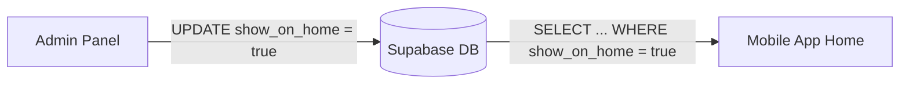

# Home Page Management: Admin-to-App Integration Guide

This document explains exactly how the Admin Panel must interact with the database to control the mobile app's Home screen.

## 1. The Core Connectivity Logic
The mobile app does **not** show all items on the Home screen. It only shows items where you have explicitly set a "Featured" or "Show on Home" flag.

### Data Flow Overview


---

## 2. Table-Specific Requirements

To make an item appear on the Home page, the Admin Panel must update these specific columns:

| Content Type | Database Table | Selection Flag | Ordering Column | App Limit |
|--------------|----------------|----------------|-----------------|-----------|
| **Pujas**    | `poojas`       | `show_on_home` | `home_order`    | **Top 3** |
| **Locations**| `destinations` | `show_on_home` | `home_order`    | **Top 4** |
| **Blogs**    | `blogs`        | `show_on_home` | `home_order`    | **Top 3** |
| **Products** | `products_99`  | `show_on_home` | `home_order`    | **Top 5** |

---

## 3. Necessary Admin UI Features

To ensure "selected" items are understood correctly, the Admin Panel should implement:

### A. The "Selected" Indicator
*   **Visual Feedback**: When a puja is selected for the Home page, the Admin UI must show a **"Selected for Home"** badge or a distinct highlight.
*   **Database Action**: Clicking "Select for Home" must trigger:
    ```sql
    UPDATE poojas SET show_on_home = true WHERE id = ' puja_id ';
    ```

### B. Ordering (1, 2, 3...)
*   The app uses the `home_order` column to decide who comes first.
*   **Admin Action**: If you want a specific Puja to be the first card on the app, set its `home_order` to `1`.
    ```sql
    UPDATE poojas SET home_order = 1 WHERE id = ' puja_id ';
    ```

### C. Enforcement of Limits
*   **Warning**: The mobile app is hardcoded to show only **3 Pujas**.
*   **Admin UI Recommendation**: If a 4th Puja is selected, the Admin Panel should show a warning: *"The app only shows 3 Pujas. This item will be hidden unless you remove another one."*

---

## 4. Troubleshooting: Why are my changes not appearing?

If you select a Puja in Admin but it doesn't show in the app, check these three things:

1.  **Is `is_active` true?** The app filters out any item where `is_active` is `false`.
2.  **Is `show_on_home` exactly `true`?** Double-check the boolean value in Supabase.
3.  **Are there more than 3 items?** If you have 5 items marked `show_on_home = true`, the app will only take the first 3 based on `home_order`.

---

## 5. Developer Hook (App Fetch Query)
For reference, this is the exact query the mobile app is running to fetch Home Pujas:
```javascript
const { data } = await supabase
  .from("poojas")
  .select("*")
  .eq("is_active", true)
  .eq("show_on_home", true)
  .order("home_order", { ascending: true })
  .limit(3);
```
